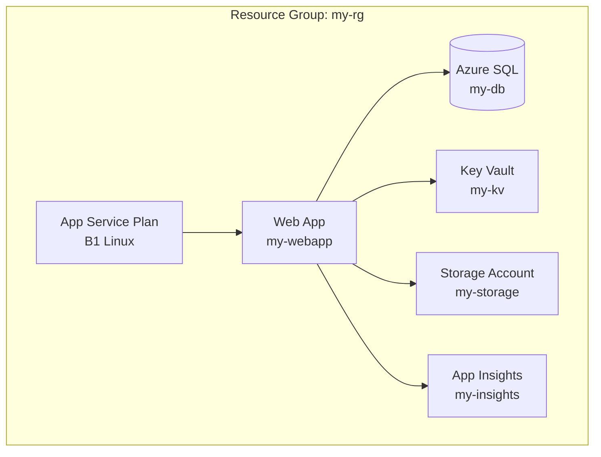

# Azure Resource Visualizer

Generate Mermaid architecture diagrams from Azure resource groups.

## When to Use

- Visualizing Azure resource relationships
- Creating architecture diagrams from live infrastructure
- Documenting existing Azure deployments
- Understanding resource dependencies

## Process

### Step 1: Query Resources
```bash
az resource list -g <RESOURCE_GROUP> -o json
az resource list -g <RESOURCE_GROUP> -o table
```

### Step 2: Identify Relationships
```bash
az network vnet list -g <RG> -o json
az webapp show --name <APP> -g <RG> --query "siteConfig"
az containerapp show --name <APP> -g <RG>
```

Common relationships to detect:
- App → Database (connection strings)
- App → Storage (storage account references)
- App → Key Vault (secret references)
- App → App Service Plan (hosting)
- VNet → Subnets → Private Endpoints
- Load Balancer → Backend Pools → VMs

### Step 3: Generate Mermaid Diagram



### Step 4: Enrich Diagram
Add to each node:
- Resource type and SKU
- Location
- Key configuration details
- Cost tier

## Diagram Conventions
- Use `graph TB` (top-to-bottom) for hierarchical architectures
- Use `graph LR` (left-to-right) for data flow diagrams
- Group related resources in subgraphs
- Use different shapes: `[]` for compute, `[()]` for databases, `{}` for networking
- Color-code by resource type when possible

## Resource Graph Queries
```bash
az graph query -q "Resources | where resourceGroup == '<RG>' | project name, type, location, sku"
```
